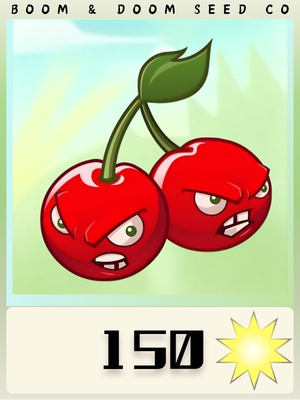
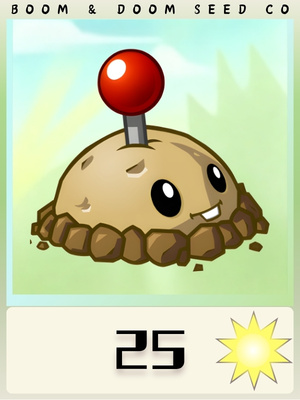
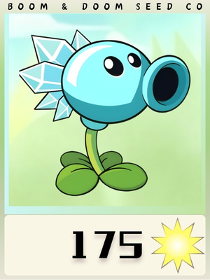
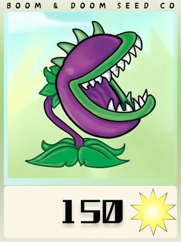
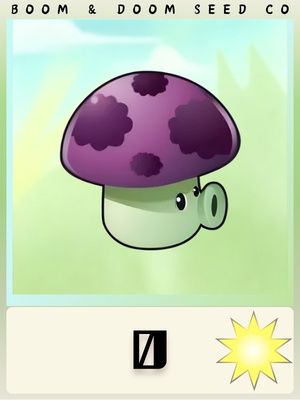

# 植物大战僵尸 - Python 复刻

基于纯 Python + Pygame (SDL2) 实现的植物大战僵尸同人游戏。

> 本项目为非商业性质的学习复刻。

[GitHub](https://github.com/288929236/Plants-vs.-Zombies-PVZ-.git)

## 运行

```bash
pip install pygame Pillow
python main.py
```

## 场景

### 1. 加载画面
旋转太阳动画 + 进度条的启动屏。
- 预加载 ~84 张图片（首页 UI、48 植物封面、3 僵尸封面、地图等）
- `precompute`：缩放裁剪所有按钮，释放原始大图
- 终端打印加载总耗时

### 2. 首页
14 个可交互按钮，`pygame.mask` 像素级悬停变亮。
- 按钮 1：进入准备战斗
- 按钮 12-13：打开信息弹窗
- 按钮 14 / ESC：打开退出弹窗（最高优先级遮罩）
- 所有按钮 surface 首次创建后缓存，切页瞬间加载

### 3. 准备战斗
48 张植物卡片（6 行 x 8 列），滑动植物框展示。
- 点击卡片选中（最多 10 张）—— 飞行动画移到顶部栏
- 点击已选卡片取消 —— 飞行动画回到网格
- START 按钮：开始战斗（退出动画）
- 右上角菜单按钮：返回首页
- 右下角箭头按钮：切换植物框开/关，地图同步滚动
- 右侧显示 6 只随机僵尸预览

### 4. 战斗场景
地图 + 倒计时 + 掉落阳光。
- 倒计时："准备！" → "3" → "2" → "1" → "开始！"
- 阳光：每 3 秒掉落，下落 5 秒，存活 10 秒，点击收集（+25）
- 阳光动画：PIL 拆解 29 帧 GIF 播放
- ESC 退出弹窗

## 目录结构

```
main.py              主入口，DPI 感知，dt 上限保护
asset_manager.py     图片加载/缓存，地图裁切，背景适配
config/
  plants.py           48 种植物定义
  zombies.py          3 种僵尸定义
  maps.py             4 张地图（白天/夜晚/泳池/屋顶）
  settings.py         首页按钮、窗口标题、字体、当前状态
comment/
  button.py           make_hover 悬停变亮，crop_visible 裁剪透明边
  popup.py            build_popup/draw_popup/hit_popup_btn（含缓存）
pages/
  loading_page.py     动画加载屏 + 资源预加载 + 按钮预计算
  home_page.py        首页（14 按钮、弹窗、三级缓存）
  prepare_page.py     准备战斗（48 卡片、箭头切换、克隆飞行动画）
  battle_page.py      战斗场景（地图、倒计时、阳光系统）
data/                 关卡 JSON（level_1-1 ~ 1-6）
store/                存档 & 选中植物
docs/                 开发日志
images/               精灵图、地图、UI 元素
```

## 内存与性能

| 优化项 | 优化前 | 优化后 | 提升 |
|--------|--------|--------|------|
| 按钮裁剪 | 2560x1600 RGBA (~16MB) | ~200x160 均值 (~128KB) | 99% |
| 植物卡片预缩放 | 每帧 smoothscale (48次) | init 一次，draw 纯 blit | 48x |
| 三级缓存 | 每次切页重新计算 | 缓存命中 | ~0ms |
| 大图压缩 | 10240x6400 原图 (~250MB) | 2560x1600 (~16MB) | 94% |

### 三级缓存

| 缓存层 | 位置 | 存储内容 | 释放时机 |
|--------|------|----------|----------|
| 图片 | asset_manager._cache | 原始图片 | 不释放（共用） |
| 弹窗 | comment.popup._popup_cache | 缩放后弹窗 surface | 不释放 |
| 页面 | home/prepare 模块缓存 | 完整按钮组 | 不释放 |

### 前10种植物封面

| 豌豆射手 | 向日葵 | 樱桃炸弹 | 坚果墙 | 土豆雷 |
|----------|--------|----------|--------|--------|
|  |  |  |  |  |
| **寒冰射手** | **大嘴花** | **双发射手** | **小喷菇** | **阳光菇** |
|  |  |  |  |  |

### 僵尸封面

| 普通僵尸 | 路障僵尸 | 铁桶僵尸 |
|----------|----------|----------|
|  |  |  |

## 植物系统（48 种）

24 基础 + 23 高级 + 吸金磁。封面统一 JPG 格式。

| 类别 | 数量 | 代表植物 |
|------|------|----------|
| 射手 | 9 | 豌豆射手、双发射手、机枪豌豆、寒冰射手等 |
| 生产 | 3 | 向日葵、阳光菇、双胞胎向日葵 |
| 爆炸 | 4 | 樱桃炸弹、土豆雷、毁灭菇、火爆辣椒 |
| 防御 | 5 | 坚果墙、高坚果、南瓜罩、大蒜、萝卜伞 |
| 特殊 | 6 | 荷叶、花盆、咖啡豆、灯笼、三叶草、金银花 |
| 吞噬 | 3 | 大嘴花、吞噬者、窝瓜 |
| 投手 | 3 | 卷心菜投手、玉米投手、西瓜投手 |
| 地面 | 3 | 地刺、地刺王、火炬树桩 |
| 蘑菇 | 7 | 小喷菇、大喷菇、胆小菇、寒冰菇、磁力菇、魅惑菇、忧郁菇 |
| 水域 | 3 | 海草、水兵菇、香蒲 |
| 其他 | 2 | 玉米加农炮、吸金磁 |

属性范围：HP 300-8000，ATK 0-1800，阳光 0-500


| Key | 名称 | HP | ATK |
|-----|------|----|-----|
| zombie | 普通僵尸 | 200 | 100 |
| conehead | 路障僵尸 | 560 | 100 |
| buckethead | 铁桶僵尸 | 1300 | 100 |

## 操作

| 操作 | 方式 |
|------|------|
| 开始游戏 | 点击首页 START 按钮 |
| 打开弹窗 | 点击首页按钮 12-14 |
| 退出弹窗 | ESC 键（所有页面） |
| 切换植物框 | 点击准备页右下角箭头 |
| 收集阳光 | 点击战斗页掉落阳光 |
| 调试坐标 | 鼠标点击控制台输出百分比 |

## 技术细节

- 窗口：NOFRAME 无边框铺满屏幕，DPI 感知 1:1 像素
- 布局：所有元素基于窗口高度百分比缩放
- 动画：入场 ease-in-out，切换/飞行/收集 ease-out
- dt 保护：`min(clock.tick(60), 50)` 防首帧跳帧
- 掩码：像素级命中检测适配异形按钮

## 关卡数据

```
data/level_1-N/
  summary.json    {chapter, stage, name, map, total_zombies, total_waves, count}
  waves.json      {waves: [{wave, zombies: [{type, row, time}]}]}
```

共 6 关：level_1-1 至 level_1-6。

## 存档 API

```python
import store.save as sv
sv.current_level()                 # 当前关卡，如 "level_1-1"
sv.save(chapter, stage)            # 写入进度
sv.record_pass(level, seconds)     # 记录通关时间
```
